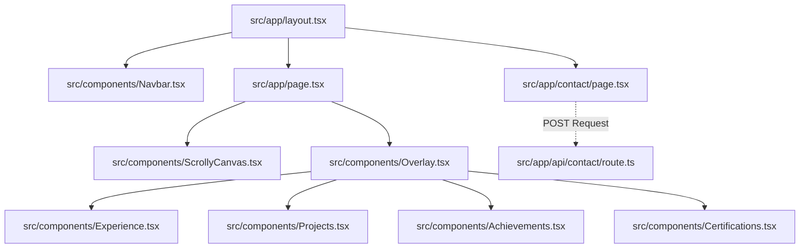

# Portfolio Project Architecture Graph

This document outlines the directory structure and component graph for the portfolio project to serve as a reference for agents and developers. It provides a high-level view of the project without needing to scan the entire repository.

## File Tree

```text
portfolio/
├── public/                 # Static assets
│   ├── achievements/       # Images for achievements
│   ├── certiications/      # Images for certifications (Note: typo in folder name)
│   └── sequence/           # Image sequence for the Scrollytelling canvas
├── src/
│   ├── app/                # Next.js App Router
│   │   ├── api/
│   │   │   └── contact/
│   │   │       └── route.ts # API Route handling contact form submissions (Nodemailer)
│   │   ├── contact/
│   │   │   └── page.tsx    # Contact page UI
│   │   ├── globals.css     # Global CSS and Tailwind v4 configuration
│   │   ├── layout.tsx      # Root application layout
│   │   └── page.tsx        # Main entry point / Home page
│   └── components/         # Reusable React components
│       ├── Achievements.tsx
│       ├── Certifications.tsx
│       ├── Experience.tsx
│       ├── Navbar.tsx      # Main navigation
│       ├── Overlay.tsx     # Content overlay for scrollytelling
│       ├── Projects.tsx    
│       └── ScrollyCanvas.tsx # Canvas component for sequence animation
├── package.json            # Dependencies: Next.js 16.2.4, React 19.2.4, Framer Motion, Tailwind v4
├── tsconfig.json           # TypeScript configuration
├── postcss.config.mjs      # PostCSS config
├── eslint.config.mjs       # ESLint configuration
├── next.config.ts          # Next.js configuration
├── resume.txt              # Raw resume text
└── Ashish_Adhikari_Resume_032026.pdf # PDF Resume
```

## Component Graph



## Tech Stack Overview
- **Framework**: Next.js (App Router)
- **Language**: TypeScript
- **Styling**: Tailwind CSS v4, PostCSS
- **Animations**: Framer Motion, HTML5 Canvas (for Scrollytelling image sequences)
- **Email Service**: Nodemailer

## Important Notes
- The `public/certiications` folder has a typo in its name.
- The project is using **Tailwind CSS v4** via PostCSS, so styling configurations might differ slightly from v3.
- The root of the application heavily utilizes a scrollytelling approach (via `ScrollyCanvas` and `Overlay`).
